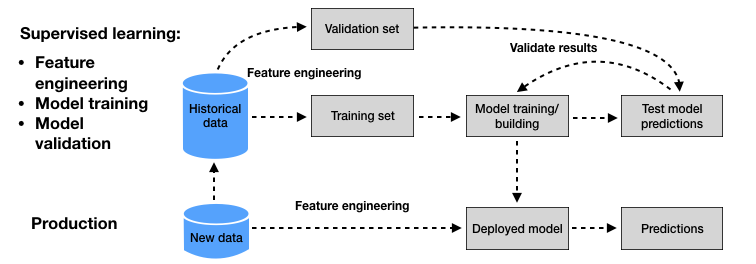
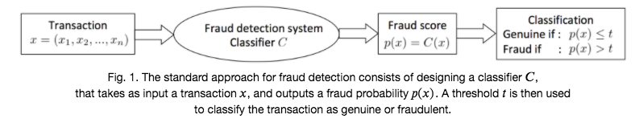
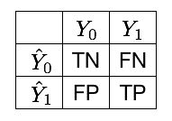
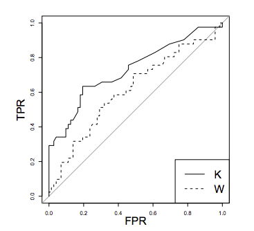

# Credit Card Fraud Detection
This project aims to detect fraudulent credit card transactions using machine learning models. The project involves data preprocessing, balancing class distributions, anomaly detection, and training multiple classifiers with hyperparameter tuning. The best model is saved for deployment.

## Dataset
The dataset is sourced from [Kaggle](https://www.kaggle.com/datasets/mlg-ulb/creditcardfraud/data). It contains transactions made by credit cards in September 2013 by European cardholders. 

* It presents transactions that occurred in two days, where we have 492 frauds out of 284,807 transactions. 
* The dataset is highly unbalanced, the positive class (frauds) account for 0.172% of all transactions. 
* It contains only numerical input variables which are the result of a PCA transformation. Features V1, V2, … V28 are the principal components obtained with PCA, the only features which have not been transformed with PCA are 'Time' and 'Amount'. 
* Feature 'Time' contains the seconds elapsed between each transaction and the first transaction in the dataset.The feature 'Amount' is the transaction Amount, this feature can be used for example-dependant cost-sensitive learning. Feature 'Class' is the response variable and it takes value 1 in case of fraud and 0 otherwise.


## Usage
1. Clone the repository
```
git clone https://github.com/yourusername/credit_card_fraud_detection.git
cd credit_card_fraud_detection
```

2. Create a virtual environment and install dependencies
```
python -m venv venv
source venv/bin/activate  # On Windows use `venv\Scripts\activate`
pip install -r requirements.txt
```

3. Download the dataset 
Download the dataset from [Kaggle](https://www.kaggle.com/datasets/mlg-ulb/creditcardfraud/data) and place the 'creditcard.csv' in data/ directory.


## Theory

### Methodology

A wide number of ML techniques are used to address the problem of CCFD. There are a huge amount of published papers on the topic in the last decade. However, there is a common baseline methodology. 



In CCFD, the data mostly consists of transaction data. It can contain account-related features, transaction-related features and customer-related features. We can visualize the methodology in two stages. First stage builds a prediction model from a set of labeled historical data (supervised learning) and the second stage uses this prediction model obtained from the supervised learning phase to predict the label of new transactions. 

For fraud detection, the predicted class for input _x_ is usually binary - fraud or not-fraud. Therefore, these prediction models are also called binary classifiers.

### Perfromance Metrics

#### Threshold-based metrics
Since fraud detection is a binary classification problem, our goal is to predict whether the transactions are likely to be genuine or fraudulent. 


* Confusion Matrix

    

    The four possible outcomes are:

    * TP: True positives. These are the instances of class 1 (fraudulent transactions), that the classifier correctly predicts as fraudulent.
    * TN: True negatives. These are the instances of class 0 (genuine transactions), that the classifier correctly predicts as genuine.
    * FP: False positives. These are the instances of class 0 (genuine transactions), that the classifier incorrectly predicts as fraudulent.
    * FN: False negatives. These are the instances of class 1 (fraudulent transactions), that the classifier incorrectly predicts as genuine.

We can derive metrics such as true positive rate or recall, true negative rate, precision, F1-score from the confusion matrix. 

* $ TPR = Recall = \frac{TP}{TP+FN}$

* $ TNR = \frac{TN}{TN+FP} $

* $ Precision = \frac{TP}{TP+FP}$

* $ \textrm{F1-score} = 2*\frac{Precision*Recall}{Precision+Recall}$

#### Threshold-free metrics
* Receiving Operating Characteristic (ROC) curve

    

    The ROC curve is obtained by plotting the Recall (or True Positive Rate - TPR) against the False Positive Rate (FPR) for all the different classification thresholds. It is the de-facto standard for estimating the performance of fraud detection systems in the literature. A classifier K is said to be more performant than a classifier W in the ROC space only if the curve of K always dominates the curve of W.

### Model Selection


### Imbalanced Learning


